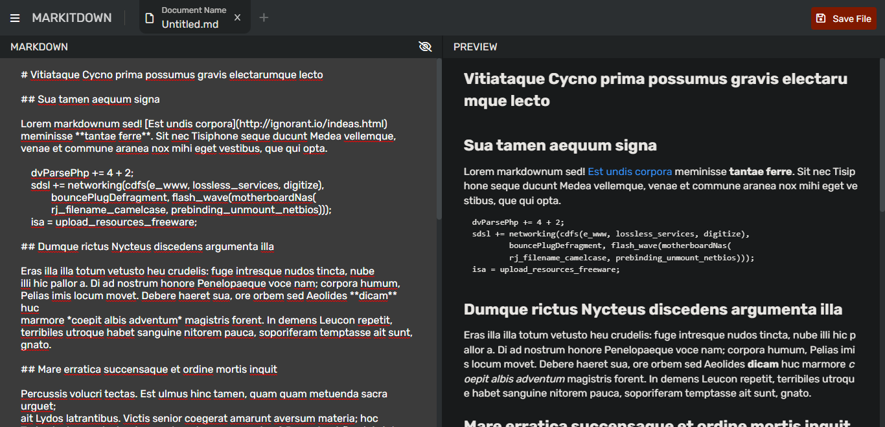
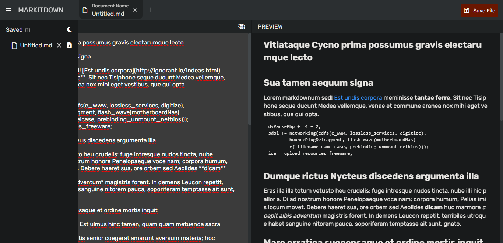
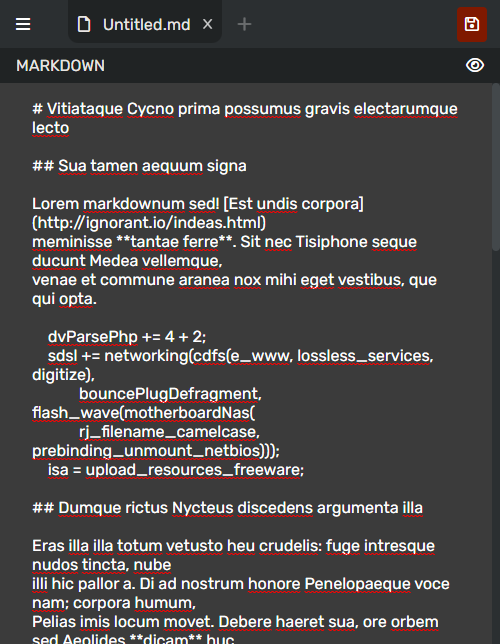
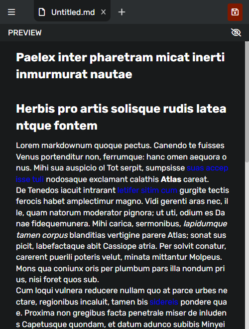

# MarkItDown

- [Demo](https://markitdown-react-i.netlify.app/)

## Screenshot

# Note:

I could've added more features like "Download/Delete All, etc..." but I preferred to keep this project as small and simple as possible as it is already too big. Also, I'd like to add that this project was for learning purposes and to demonstrate my React skills.